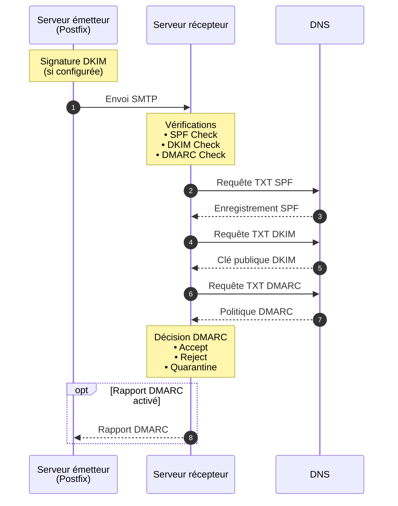

# Introduction à l'Authentification Email

## Contexte et problématique

Le protocole SMTP (Simple Mail Transfer Protocol), créé en 1982, ne possède aucun mécanisme d'authentification de l'expéditeur intégré. N'importe quel serveur peut envoyer un email en prétendant provenir de n'importe quel domaine. Cette faiblesse fondamentale a conduit à :

- **Spam massif** : Envoi de courriers non sollicités en masse
- **Phishing** : Usurpation d'identité pour voler des informations sensibles
- **Spoofing** : Falsification de l'adresse d'expédition
- **Compromission de réputation** : Utilisation malveillante du nom de domaine d'une organisation

## Les mécanismes d'authentification

Pour répondre à ces problématiques, trois mécanismes principaux ont été développés :

### SPF (Sender Policy Framework)

Publié en 2006 (RFC 4408, puis RFC 7208 en 2014), SPF permet aux propriétaires de domaines de définir quels serveurs sont autorisés à envoyer des emails pour leur domaine.

**Principe** : Validation de l'adresse IP du serveur émetteur contre une liste publiée dans le DNS.

### DKIM (DomainKeys Identified Mail)

Standardisé en 2007 (RFC 4871, puis RFC 6376 en 2011), DKIM utilise la cryptographie à clé publique pour signer les emails et garantir leur intégrité.

**Principe** : Signature cryptographique des messages vérifiable via une clé publique publiée dans le DNS.

### DMARC (Domain-based Message Authentication, Reporting and Conformance)

Introduit en 2012 (RFC 7489 en 2015), DMARC s'appuie sur SPF et DKIM pour définir une politique d'authentification et un mécanisme de reporting.

**Principe** : Politique d'alignement qui indique au serveur destinataire quoi faire des messages qui échouent aux contrôles SPF ou DKIM.

## Flux de validation d'un email

Lorsqu'un email est envoyé, voici le processus de validation :



## Avantages de l'authentification email

### Pour l'expéditeur

- Protection de la réputation du domaine
- Réduction de l'usurpation d'identité
- Meilleure délivrabilité des emails légitimes
- Visibilité sur l'utilisation du domaine (via les rapports DMARC)

### Pour le destinataire

- Filtrage efficace du spam et du phishing
- Confiance accrue dans l'origine des messages
- Réduction des risques de sécurité

### Pour l'écosystème email

- Amélioration globale de la sécurité
- Réduction du volume de spam
- Standardisation des pratiques d'authentification

## Adoption et exigences actuelles

En 2026, l'authentification email n'est plus optionnelle :

- **Google et Yahoo** : Depuis février 2024, SPF, DKIM et DMARC sont obligatoires pour les expéditeurs en volume (>5000 messages/jour)
- **Microsoft Office 365** : Recommandation forte de DMARC
- **Organismes gouvernementaux** : Obligation dans de nombreux pays
- **Conformité** : Requis pour diverses certifications de sécurité

## Prérequis pour suivre ce guide

- Accès root ou sudo sur un serveur Linux
- Serveur Postfix installé et fonctionnel
- Contrôle de la zone DNS du domaine
- Connaissances de base en administration système Linux
- Compréhension des concepts DNS et SMTP

## Architecture type

Ce guide suppose l'architecture suivante :

```
Serveur mail (Postfix)
├── Système d'exploitation : Debian/Ubuntu ou RHEL/Rocky
├── MTA : Postfix
├── SPF : Vérification via policyd-spf
├── DKIM : Signature via OpenDKIM
└── DMARC : Analyse via OpenDMARC

DNS
├── Enregistrements SPF (TXT)
├── Enregistrements DKIM (TXT)
└── Enregistrements DMARC (TXT)
```

Dans les chapitres suivants, nous détaillerons chaque mécanisme, leur fonctionnement technique, et leur mise en œuvre pratique.
