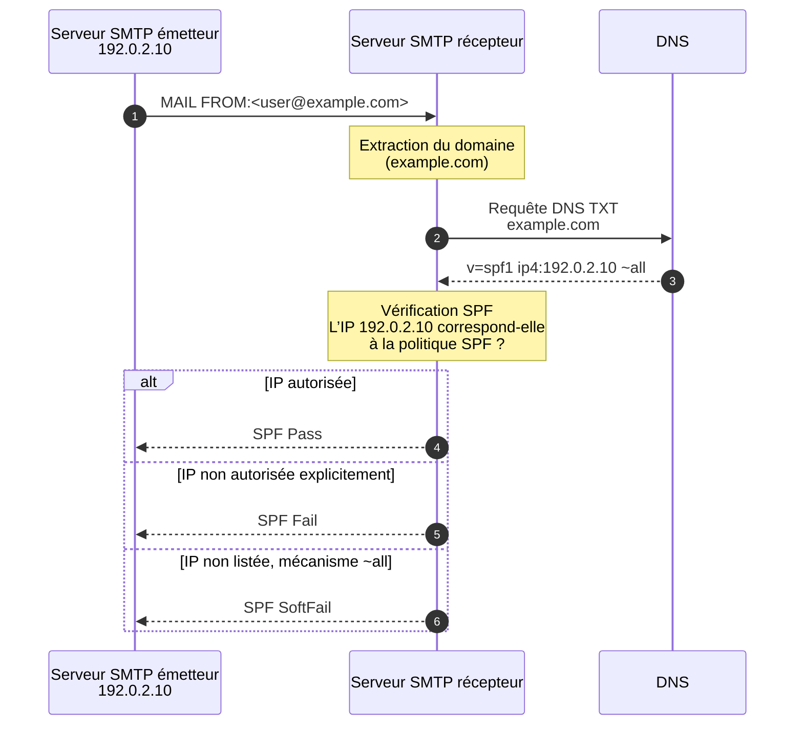

# SPF - Sender Policy Framework

## Principe et fonctionnement

SPF (RFC 7208) permet au propriétaire d'un domaine de définir quels serveurs sont autorisés à envoyer des emails pour son domaine. Le serveur récepteur vérifie l'adresse IP de l'émetteur contre cette politique.

### Flux de validation SPF



### Quand est-ce que SPF est vérifié?

SPF est vérifié sur l'adresse **MAIL FROM** (aussi appelée "envelope from" ou "Return-Path"), pas sur l'adresse **From** visible dans l'en-tête.

```text
MAIL FROM: <bounce@example.com>     ← Vérifié par SPF
From: contact@example.com            ← Visible par l'utilisateur (vérifié par DMARC)
```

## Syntaxe des enregistrements SPF

### Structure de base

```text
v=spf1 <mechanisms> <qualifier>
```

**Composants obligatoires** :

- `v=spf1` : Version du protocole (toujours "spf1")
- Qualificateur final : `all`, `~all`, `-all` ou `?all`

### Mécanismes

Les mécanismes définissent quels serveurs sont autorisés :

| Mécanisme | Description                                 | Exemple                                  |
| --------- | ------------------------------------------- | ---------------------------------------- |
| `ip4`     | Adresse ou plage IPv4                       | `ip4:192.0.2.10` ou `ip4:192.0.2.0/24`   |
| `ip6`     | Adresse ou plage IPv6                       | `ip6:2001:db8::1` ou `ip6:2001:db8::/32` |
| `a`       | L'enregistrement A du domaine               | `a` ou `a:mail.example.com`              |
| `mx`      | Les serveurs MX du domaine                  | `mx` ou `mx:example.com`                 |
| `include` | Inclure la politique SPF d'un autre domaine | `include:_spf.google.com`                |
| `exists`  | Vérifie l'existence d'un enregistrement A   | `exists:%{i}.spamhaus.example.com`       |
| `ptr`     | Résolution inverse (déprécié, éviter)       | `ptr:example.com`                        |
| `all`     | Attrape-tout (doit être en dernier)         | `all`                                    |

### Qualificateurs

Chaque mécanisme peut être préfixé par un qualificateur :

| Qualificateur | Symbole       | Signification         | Résultat SPF |
| ------------- | ------------- | --------------------- | ------------ |
| Pass          | `+` (ou rien) | Autorisé              | Pass         |
| Fail          | `-`           | Interdit              | Fail         |
| SoftFail      | `~`           | Probablement interdit | SoftFail     |
| Neutral       | `?`           | Aucune information    | Neutral      |

**Exemples** :

```text
ip4:192.0.2.10       → Pass si IP match
-ip4:192.0.2.50      → Fail si IP match
~all                 → SoftFail pour toutes les autres IP
-all                 → Fail pour toutes les autres IP
```

### Modificateurs

Les modificateurs ajoutent des informations supplémentaires :

| Modificateur | Description                          | Exemple                     |
| ------------ | ------------------------------------ | --------------------------- |
| `redirect`   | Redirige vers un autre domaine       | `redirect=_spf.example.com` |
| `exp`        | Message d'explication en cas d'échec | `exp=explain.example.com`   |

## Exemples d'enregistrements SPF

### SPF simple

Autoriser uniquement les serveurs MX du domaine :

```text
v=spf1 mx -all
```

### SPF avec adresses IP

Autoriser des IP spécifiques :

```text
v=spf1 ip4:192.0.2.10 ip4:192.0.2.20 ip4:203.0.113.0/24 -all
```

### SPF avec include

Utiliser un service tiers (Google Workspace) :

```text
v=spf1 include:_spf.google.com mx -all
```

### SPF complexe

Combiner plusieurs mécanismes :

```text
v=spf1 mx ip4:192.0.2.0/24 include:_spf.google.com include:sendgrid.net a:mail.example.com ~all
```

### SPF avec redirection

Déléguer la politique à un autre domaine :

```text
v=spf1 redirect=_spf.example.com
```

Et sur `_spf.example.com` :

```text
v=spf1 ip4:192.0.2.0/24 mx -all
```

## Résultats SPF

Lors de la vérification SPF, plusieurs résultats sont possibles :

| Résultat      | Signification                                | Action typique                |
| ------------- | -------------------------------------------- | ----------------------------- |
| **Pass**      | L'IP est explicitement autorisée             | Accepter                      |
| **Fail**      | L'IP est explicitement interdite (`-all`)    | Rejeter ou marquer comme spam |
| **SoftFail**  | L'IP est probablement non autorisée (`~all`) | Accepter mais marquer         |
| **Neutral**   | Pas d'information (`?all`)                   | Accepter                      |
| **None**      | Pas d'enregistrement SPF                     | Accepter                      |
| **TempError** | Erreur temporaire DNS                        | Accepter temporairement       |
| **PermError** | Erreur permanente (syntaxe invalide)         | Politique locale              |

## Limites de SPF

### Limite de lookups DNS

SPF impose une limite de **10 requêtes DNS** pour éviter les abus.

**Comptabilisés** :

- `include`
- `a`
- `mx`
- `exists`
- `ptr` (déprécié)

**Non comptabilisés** :

- `ip4`
- `ip6`
- `all`

**Exemple dépassant la limite** :

```text
v=spf1 include:_spf1.example.com include:_spf2.example.com include:_spf3.example.com \
       include:_spf.google.com include:sendgrid.net include:_spf.salesforce.com \
       include:servers.mcsv.net include:_spf.example.org include:mail.zendesk.com \
       include:_spf.createsend.com include:spf.protection.outlook.com mx -all
```

**Résultat** : PermError (plus de 10 lookups).

**Solutions** :

1. **Aplatir le SPF** : Remplacer les `include` par les IP directes
2. **Utiliser des sous-domaines** : Séparer les flux d'emails
3. **Nettoyer** : Supprimer les includes inutilisés

**Outil pour compter** :

```bash
# Utiliser un outil en ligne comme dmarcian.com/spf-survey/
# Ou un script qui récursivement résout les includes
```

### SPF et transfert d'emails (forwarding)

Problème : Lors d'un transfert, l'IP change mais le MAIL FROM reste le même.

```text
User@example.com ──> MailServer1 ──> MailServer2 (forwarding) ──> Gmail
     (SPF Pass)           |                  |              (SPF Fail)
                          |                  |              car IP de MailServer2
                     IP autorisée       IP non autorisée    n'est pas dans SPF
                                                              d'example.com
```

**Solutions** :

- **SRS (Sender Rewriting Scheme)** : Réécrire le MAIL FROM lors du transfert
- **ARC (Authenticated Received Chain)** : Préserver les résultats d'authentification

### SPF ne protège pas l'en-tête From

SPF vérifie uniquement le MAIL FROM (envelope), pas le From visible :

```text
MAIL FROM: <bounce@attacker.com>     ← SPF Pass (domaine de l'attaquant)
From: ceo@example.com                ← Visible par l'utilisateur (pas vérifié par SPF)
```

**Solution** : DMARC vérifie l'alignement entre les deux.

## Mise en place de SPF

### Audit des sources d'envoi

Avant de créer l'enregistrement SPF, identifier toutes les sources légitimes :

1. **Serveurs mail internes** : Postfix, Exchange, etc.
2. **Services cloud** : Google Workspace, Office 365
3. **Services marketing** : Mailchimp, SendGrid, Salesforce
4. **Applications** : CRM, ERP, notifications système
5. **Serveurs web** : Formulaires de contact

**Méthode** :

```bash
# Analyser les logs Postfix pour identifier les sources
grep "client=" /var/log/mail.log | awk '{print $7}' | sort | uniq

# Analyser les rapports DMARC si déjà en place
```

### Construction de l'enregistrement

**Étape 1** : Lister les adresses IP des serveurs internes

```text
ip4:192.0.2.10 ip4:192.0.2.20
```

**Étape 2** : Ajouter les includes pour services tiers

```text
include:_spf.google.com include:sendgrid.net
```

**Étape 3** : Choisir le qualificateur final

- Pendant les tests : `~all` (SoftFail)
- En production : `-all` (Fail)

**Enregistrement complet** :

```
v=spf1 ip4:192.0.2.10 ip4:192.0.2.20 include:_spf.google.com include:sendgrid.net ~all
```

### Publication DNS

**Syntaxe Bind** :

```text
example.com.  IN  TXT  "v=spf1 ip4:192.0.2.10 include:_spf.google.com ~all"
```

**Vérification après publication** :

```bash
dig example.com TXT +short | grep spf
nslookup -type=TXT example.com
```

### Phase de test

**Étape 1** : Utiliser `~all` (SoftFail) pendant 1-2 semaines

```text
v=spf1 mx ip4:192.0.2.10 include:_spf.google.com ~all
```

**Étape 2** : Analyser les rapports DMARC pour identifier les sources manquantes

**Étape 3** : Basculer vers `-all` (Fail)

```text
v=spf1 mx ip4:192.0.2.10 include:_spf.google.com -all
```

## Validation et vérification

### Outils de vérification syntaxe

**En ligne** :

- https://mxtoolbox.com/spf.aspx
- https://www.kitterman.com/spf/validate.html
- https://dmarcian.com/spf-survey/

**En ligne de commande** :

```bash
# Vérifier l'enregistrement
dig example.com TXT +short

# Tester le SPF d'un domaine
python3 -m pyspf check example.com 192.0.2.10
```

### Test d'envoi

Envoyer un email de test et vérifier les en-têtes reçus :

```text
Received-SPF: pass (google.com: domain of sender@example.com designates 192.0.2.10 as permitted sender)
Authentication-Results: mx.google.com;
       spf=pass (google.com: domain of sender@example.com designates 192.0.2.10 as permitted sender) smtp.mailfrom=sender@example.com
```

### Outils pour compter les lookups DNS

```bash
# Script bash simple
#!/bin/bash
SPF=$(dig +short example.com TXT | grep "v=spf1")
echo "SPF Record: $SPF"
echo "Include count:"
echo "$SPF" | grep -o "include:[^ ]*" | wc -l
echo "A count:"
echo "$SPF" | grep -o " a \| a:" | wc -l
echo "MX count:"
echo "$SPF" | grep -o " mx \| mx:" | wc -l
```

## Problèmes courants SPF

### Plusieurs enregistrements SPF

**Erreur** :

```text
example.com.  IN  TXT  "v=spf1 mx -all"
example.com.  IN  TXT  "v=spf1 include:_spf.google.com -all"
```

**Résultat** : Comportement imprévisible (selon le résolveur).

**Solution** : Fusionner en un seul enregistrement.

### Dépassement de la limite de 10 lookups

**Symptôme** : PermError

**Solution** : Aplatir le SPF ou utiliser des sous-domaines.

### Oubli du `all`

**Erreur** :

```
v=spf1 mx ip4:192.0.2.10
```

**Résultat** : Neutral pour toutes les IP non listées.

**Solution** : Toujours terminer par `~all` ou `-all`.

### Utilisation de `ptr`

**Erreur** :

```text
v=spf1 ptr:example.com ~all
```

**Problème** : Mécanisme déprécié, lent, peu fiable.

**Solution** : Utiliser `ip4` ou `a` à la place.

### Include d'un domaine sans SPF

**Erreur** :

```text
v=spf1 include:nonexistent.com ~all
```

**Résultat** : PermError si le domaine n'existe pas ou n'a pas de SPF.

**Solution** : Vérifier que tous les domaines inclus ont bien un SPF valide.

## SPF pour sous-domaines

Par défaut, les sous-domaines n'héritent pas du SPF du domaine parent.

**Exemple** :

```text
example.com      : v=spf1 mx -all
mail.example.com : (pas de SPF) → Résultat "None"
```

**Solutions** :

1. **Créer un SPF pour chaque sous-domaine utilisé** :

   ```text
   mail.example.com.  IN  TXT  "v=spf1 a -all"
   ```

2. **Utiliser un wildcard (avec prudence)** :

   ```text
   *.example.com.  IN  TXT  "v=spf1 -all"
   ```

## SPF et IPv6

Support complet d'IPv6 dans SPF :

```text
v=spf1 ip4:192.0.2.0/24 ip6:2001:db8::/32 mx -all
```

**Attention** : Ne pas oublier les adresses IPv6 si le serveur est dual-stack.

## Aplatissement de SPF (SPF Flattening)

Lorsque la limite de 10 lookups est atteinte, il faut "aplatir" le SPF.

**Avant (11 lookups - PermError)** :

```text
v=spf1 include:_spf.google.com include:sendgrid.net include:_spf.salesforce.com \
include:mail.zendesk.com mx a -all
```

**Après aplatissement** :

```text
v=spf1 ip4:64.233.160.0/19 ip4:66.102.0.0/20 ip4:167.89.0.0/17 \
ip4:168.245.0.0/16 ip4:192.0.2.10 ip4:192.0.2.20 -all
```

**Inconvénient** : Nécessite une mise à jour manuelle si les IP des services tiers changent.

**Solutions automatisées** :

- **autospf.com**
- **dmarcian.com**
- Scripts personnalisés qui résolvent périodiquement les includes

## Macro-expansion SPF (avancé)

SPF supporte des macros pour des configurations dynamiques :

| Macro  | Description                |
| ------ | -------------------------- |
| `%{s}` | Adresse email expéditeur   |
| `%{l}` | Partie locale de l'email   |
| `%{d}` | Domaine                    |
| `%{i}` | Adresse IP de l'expéditeur |

**Exemple avec exists** :

```text
v=spf1 exists:%{i}.spamhaus.example.com ~all
```

Vérifie si l'IP est listée dans une blacklist.

## SPF et services cloud

### Google Workspace

```text
v=spf1 include:_spf.google.com ~all
```

### Microsoft Office 365

```text
v=spf1 include:spf.protection.outlook.com ~all
```

### SendGrid

```text
v=spf1 include:sendgrid.net ~all
```

### Mailchimp

```text
v=spf1 include:servers.mcsv.net ~all
```

### OVH

```text
v=spf1 include:mx.ovh.com ~all
```

## Récapitulatif SPF

**Forces** :

- Simple à comprendre et mettre en place
- Empêche l'usurpation basique de domaine
- Largement supporté

**Faiblesses** :

- Limité à 10 lookups DNS
- Problème avec le transfert d'emails
- Ne protège que l'envelope (MAIL FROM)
- Ne signe pas le contenu

**Bonnes pratiques** :

1. Commencer avec `~all` puis passer à `-all`
2. Compter les lookups DNS (rester sous 10)
3. Documenter toutes les sources d'envoi
4. Monitorer les rapports DMARC
5. Mettre à jour régulièrement
6. Utiliser un TTL raisonnable (3600)
